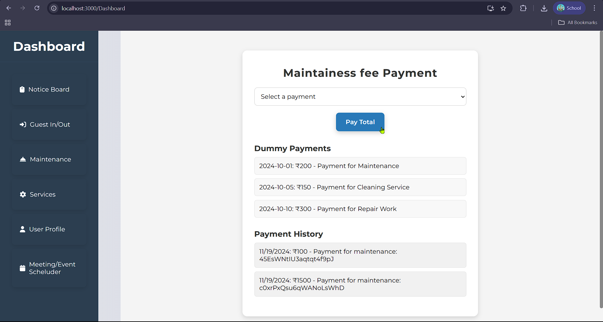
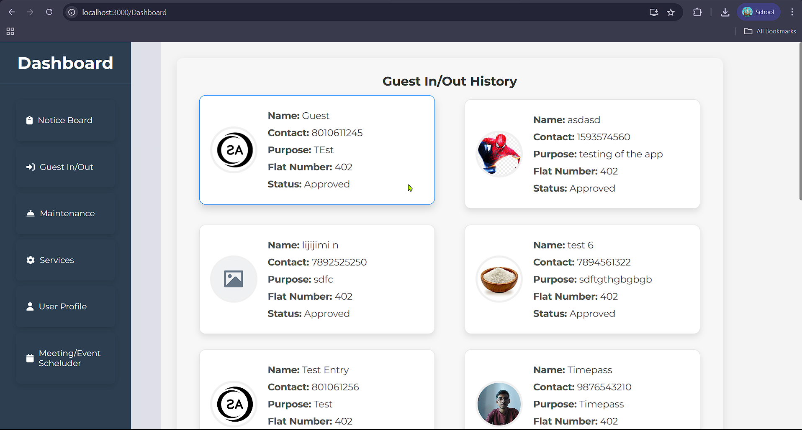

# 🏠 AapniSociety – Society Management Web Platform
A full-featured web platform for managing residential societies efficiently. The system helps admins and residents with visitor tracking, maintenance payments, service bookings, notice boards, and more.

## ✨ Features
🪪 Visitor In/Out Tracking – Approve or log guest visits with details

💵 Maintenance Fee Payment – Pay society dues using Razorpay integration

🧹 Book Services – Cleaning, Plumbing, Gardening, Grocery, etc.

📋 Notice Board – Post and view announcements

🧰 Admin Panels – For electricians, Kirana store, etc.

📅 Event/Meeting Scheduler – Notify residents of upcoming events

👤 User Profile – Resident-specific details and preferences

🎥 Demo
🔗 [Landing Page & Overview (Google Drive)](https://drive.google.com/file/d/1Q2r0LFJRni1Y3kT_jXi7Qbp3hrnaCRmD/view?usp=drive_link)

🔗 [Notice Board + Electrician Service Workflow – Watch Demo (Google Drive)](https://drive.google.com/file/d/1ixub76MZ3eGNLEPAj-pZ_8ArY4aTYpyM/view?usp=drive_link)

## 🖼️ Screenshots
🧰 Services Module


💳 Maintainance Fee Payment (Razorpay Integration)


🚪 Guest In/Out Management



## ⚙️ Tech Stack
- 🎨 **Frontend**: React.js, CSS
  
- 🛠️ **Backend**: Node.js, Python
  
- 🗄️ **Database**: Firebase
  
- 🔐 **Authentication**: Firebase
  
- 💳 **Payment Gateway**: Razorpay
  

## 🚀 How to Run Locally

```
 Go to project directory
cd aapni-society

# Install frontend dependencies
cd frontend
npm install
npm start

# Install backend dependencies
cd ../backend
npm install
npm start
```

---

## 📬 Connect With Me
🔗 [LinkedIn]([https://www.linkedin.com/in/yourusername](https://www.linkedin.com/in/divyansh-mohta-36094225a/))  
