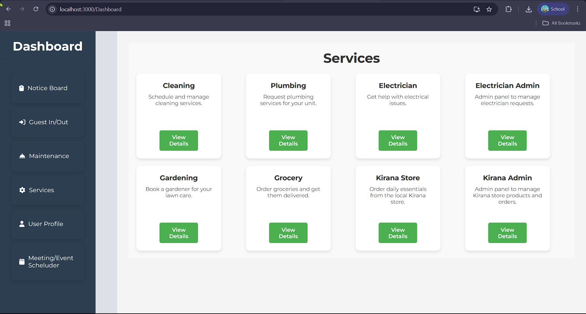
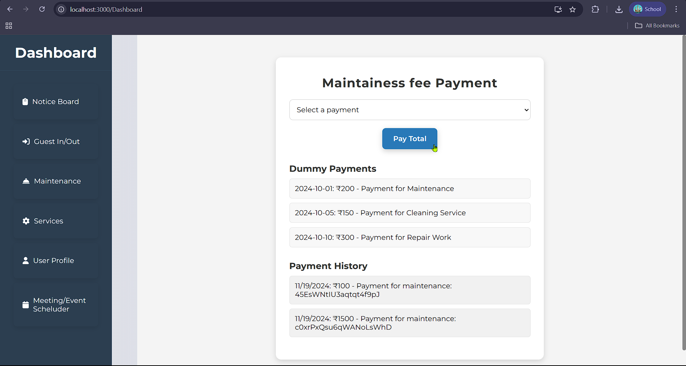

# 🏠 AapniSociety – Society Management Web Platform
A full-featured web platform for managing residential societies efficiently. The system helps admins and residents with visitor tracking, maintenance payments, service bookings, notice boards, and more.

## ✨ Features
🪪 Visitor In/Out Tracking – Approve or log guest visits with details

💵 Maintenance Fee Payment – Pay society dues using Razorpay integration

🧹 Book Services – Cleaning, Plumbing, Gardening, Grocery, etc.

📋 Notice Board – Post and view announcements

🧰 Admin Panels – For electricians, Kirana store, etc.

📅 Event/Meeting Scheduler – Notify residents of upcoming events

👤 User Profile – Resident-specific details and preferences

🎥 Demo
🔗 Landing Page & Overview – Watch on YouTube (replace with your actual link)

🔗 Notice Board + Electrician Service Workflow – Watch Demo

## 🖼️ Screenshots
🧰 Services Module


💳 Maintainance Fee Payment (Razorpay Integration)


🚪 Guest In/Out Management
)


## ⚙️ Tech Stack
Frontend: React.js, CSS
Backend: Node.js, Python
Database: FireBase
Authentication: FireBase
Payment Gateway: Razorpay


# Go to project directory
```
cd aapni-society

# Install frontend dependencies
cd frontend
npm install
npm start

# Install backend dependencies
cd ../backend
npm install
npm start
```
